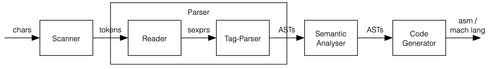

# Scheme-Compiler
Implementation of Scheme compiler. Written in Ocaml.
The compiler takes a scheme source code (file written in Scheme), 
converts it to assembly and creates executable file to run (file written in Assembly).

# Table of contents
<!--ts-->
   * [Compiler pipeline](#Compiler-pipeline)
   * [The Reader](#The-Reader)
   * [The Tag Parser](#The-Tag-Parser)
      * [Core forms](#Core-forms)
      	* [Constants](#Constants)
	    * [Variables](#Variables)
	    * [Conditionals](#Conditionals)
	    * [Sequences](#Sequences)
	    * [Assignments](#Assignments)
	    * [Definitions](#Definitions)
	    * [Disjunctions](#Disjunctions)
	    * [Lambda Expressions](#Lambda-Expressions)
	  * [Macro expansions](#Macro-expansions)
	    * [Quasiquoted expressions](#Quasiquoted-expressions)
	    * [Cond expressions](#Cond-expressions)
	    * [Let expressions](#Let-expressions)
	    * [Let* expressions](#Let*-expressions)
	    * [LetRec expressions](#LetRec-expressions)
	    * [And expressions](#And-expressions)
	    * [MIT define expressions](#MIT-define-expressions)
   * [The Semantic Analyzer](#The-Semantic-Analyzer)
        * [Lexical addressing](#Lexical-addressing)
        * [Annotating tail calls](#Annotating-tail-calls)
        * [Boxing of variables](#Boxing-of-variables)
   * [The Code Generator](#The-Code-Generation)
        * [Free-var table](#Free-var-table)
        * [Const-var table](#Const-var-table)
        * [Compiler.ml](#Compiler.ml)
        * [Makefile](#Makefile)
   * [How to run](#How-to-run)
<!--te-->

Compiler pipeline
=========
  
 
The Reader
=========

The reader is a parser for extended S-expressions: It reads text from a string, and outputs an abstract syntax tree for extended S-expressions.
This procedure takes a string, assuming it contains any number of sexprs, and returns a list of abstract syntax trees that correctly represent the input. Such ASTs are represented by the sexpr type defined in reader.ml.

The Tag Parser
=========

The tag-parser converts from the AST of sexprs to the AST of expressions, and performs macro- expansions along the way. Such ASTs are represented by the expr type defined in tag-parser.ml.

## Core forms

This is the expr type which defines the abstract syntax of scheme expressions:
type expr =
| Const of constant
| Var of string
| If of expr * expr * expr
| Seq of expr list
| Set of expr * expr
| Def of expr * expr
| Or of expr list
| LambdaSimple of string list * expr
| LambdaOpt of string list * string * expr | Applic of expr * (expr list)

type constant =
| Sexpr of sexpr | Void

### Constants

Constants come in two forms: quoted and unquoted. The field of any quoted form is a constant. Self-evaluating forms (Booleans, chars, numbers, strings) are constants too, even if they haven’t been quoted.

### Variables

The concrete syntax of variables is given as unquoted symbols that are not reserved words. For each variable instance of Variable is generated.

### Conditionals

Support both the if-then & if-then-else forms of conditions in Scheme (If). If-then forms expand into if-then-else forms, where the else field has the value Const (Void).

### Sequences
There are two kinds of sequences of expressions: explicit, and implicit. Explicit sequences are proper lists in which the symbol begin is the first element. Implicit sequences of expressions appear in various special forms, such as cond, lambda, let, etc. Both kinds of sequences will be parsed using the Seq type constructor.
Similar to the handling of or and and forms, tag-parsed sequences have two base forms which differ from the general tag-parsed form:
-An empty sequence should be tag-parsed to Const Void.
-A sequence with a single element should not be tag-parsed as a sequence.
An expr should not contain nested sequences (neither explicit nor implicit), such sequences should be flattened into a single sequence.

### Assignments
Assignments are written using set!-expressions (Set) or pset!-expressions. set!-expressions are core-forms that supported by using the type constructor Set. pset!-expressions are supported using macro-expansions (as explained further below).

### Definitions
There are two ways to write definitions in Scheme: The basic way, and “the MIT-syntax for define”, which is used to define procedures, and which appears throughout the book The Structure and Interpretation of Computer Programs. Simple define expressions are considered core forms (Def) while MIT define expressions will be treated as macros.

### Disjunctions
Disjunctions are simply or-expressions (Or). We shall be supporting
or-expressions as a core form, while macro-expanding and-expressions.

### Lambda Expressions
There are 3 kinds of λ-expressions in Scheme: simple, with optional arguments and variadic. We will be using two forms to represent these three different λ- expressions: LambdaSimple of string list * expr and LambdaOpt of string list * string * expr. Variadic λ-expressions are represented as LambdaOpt structures with an empty list of required parameters. The body of a lambda-expression is an implicit sequence.

## Macro expansions

### Quasiquoted expressions
Upon recognizing a quasiquoted-expression, we will expand the expression while considering unquote and unquote-splicing subexpressions. After performing the initial expansion, we will call the tag-parser recursively over the expanded form.
we should not support nested quasiquote-expressions.

### Cond expressions
We will expand cond-expressions, while supporting 3 types of ribs. The tag-parser should be called recursively over the expanded form. A cond without an else rib returns Const (Void) if none of the tests match (this required should be automatically covered by the expansion of if-then to if-then-else). In addition, cond ribs of type 1 and of type 3 contain implicit sequence of expressions.

### Let expressions
We will expand these into applications, and call the tag-parser recursively.

### Let* expressions
We will Expand these into nested let expressions, and call the tag-parser recursively.

### LetRec expressions
We will Expand these into let-expressions with assignmentes, and call the tag-parser recursively.

### And expressions
We will Expand these into nested if-expressions, and call the tag-parser recursively.

### MIT define expressions
MIT-style define-expressions have the form (define (<name> . <argl>) . (<expr> +)), where:
- <name> is the name of the variable
- <argl> represents the list of parameters
- <expr> + is a non-empty sequence of expressions
The MIT-style define-expression should be macro-expanded into a simple define-expression containing the relevant lambda form. The tag-parser should be called recursively over the expanded form.

The Semantic Analyzer
=========
Add on to the compiler a component of semantic analysis. This component shall compute the lexical addresses for all variables, annotate applications in tail- position, and box variables that are copied from the stack to the heap, and that changes to which may be visible elsewhere in the code.
The output of the semantic analysis phase should be of type expr', and this is what the code generator (in the final stage) shall receive.

## Lexical addressing
Takes an expr and returns an expr', where all Var records have been replaced by Var' records. The type constructor Var' holds a value of type var, which is a disjoint type made of VarFree, VarParam, and VarBound. So instances of Var' should contain their lexical address.
Lexical addressing:
• Parameter instances should be tagged using the VarParam type constructor. The string value should be the repackaged variable name and the int value should be the minor index of the parameter in the closure (0-based index).
• Bound variable instances should be tagged using the VarBound type constructor. The string value should be the repackaged variable name, the first int value should be the major index of the bound instance in the closure (0-based index), and the second int value should be the minor index of the bound instance in the closure (0-based index).
• All variable instances which are neither parameter nor bound instances are free variable instances. Free variable instances should be tagged using the VarFree type constructor, in which the string value should be the repackaged variable name.

## Annotating tail calls
In annotating tail-calls, the compiler will need to replace some instances of Applic' with corresponding instances of ApplicTP'. We call the procedure annotate_tail_calls on each of the sub-expressions, to make sure the entire AST is converted, all the way to the leaves.

## Boxing of variables
Boxing is a process by which the compiler automatically packs a value in a box when needed. The need to automatically box a value comes from the parameter passing mechanism used in Scheme - Call By Sharing. Boxing is required when we need to elevate this passing mechanism in order to pass a value to different bodies of code and have all these piece be able to to modify the same reference.
There are two criteria for boxing variables:
• The variable has (at least) one read occurrence within some closure, and (at least) one write occurrence in another closure.
• Both occurrences do not already refer to the same rib in a lexical environment.
These rules are always sufficient, but sometime unnecessary.
For each variable VarParam(v, minor) that should be boxed, we must do 3 things:
1. Add the expression Set'(VarParam(v, minor), Box'(VarParam(v,minor))) as the first expression in the sequence of the body of the lambda-expression in which it is defined.
2. Replace any get-occurances of v with BoxGet' records. These occurrences can be either parameter instances or bound instances.
3. Replace any set-occurrences of v with BoxSet' records. These occurrences can be either parameter instances or bound instances.

The Code Generator
=========
The last step in the pipeline. Converts a code snippet written in Scheme to Assembly code.

## Free-var table
The free-vars table maps between the free variables and their values. Initially each variable is mapped as UNDEFINED, using define expressions to change the values in this table.
The runtime framework, being a collection of free-vars, will also be defined in the free-vars table. However, some of those do not have a define expression, since they are defined in assembly code. so in order to set their values, we will need to emulate a define for them in the beginning of our code.
We will generate a two-column free variables table (variable name, relative address of the free variable).

## Const-var table
The constants table holds all the constants used in the compiled code. This includes any nested SOBs in composite constants, so, for instance, the car and cdr of a constant pair are also found in the constants table.
The reason we need a constants table is so we can reuse the same allocated data (i.e. constants) again and again, every time it’s used in the compiled code. The alternative would have been to allocate a new SOB every time we use a constant. This is an optimization.
We will generate a three-column constants table (const, relative address of the constant, and the assembly representation of the constant).

## Compiler.ml
When executing compiler.ml, the following steps are performed:
• The name of a Scheme source file to compile (e.g., foo.scm) is extracted from from the ocaml command line arguments array and stored in the variable inflie.
• The contents of stdlib.scm and infile are read into memory, and catenated into a single string code.
• code is processed by the reader, returning a list of sexprs.
• The list of sexprs is tagged by the tag parser,returning a list of exprs.
• Each expr in the is annotated by the run_semantics procedure, resulting in a list of expr’s.
• The tables for constants and free-variables are constructed.
• generate is applied to each expr’, resulting in a list of snippets of x86-64bit assembly instructions.
• A call to a printing routine (write_sob_if_not_void implemented in compiler.s) is appended to each snippet. This facilitates the desired output format and behavior of the executables the compiler will generate.
• The assembly snippets are all catenated together into a single string and store in the variable code_fragment.
• A prologue is prepended and an epilogue is appended to code-fragment, resulting in a self- contained assembly language program.
• The self contained assembly program is printed to stdout.

## Makefile
The Makefile takes the name of an input file without the extension. Assuming we run the Makefile with the argument foo, the following steps are performed:
• compiler.ml is applied to foo.scm which is assumed to exist, and the output is stored in foo.s
• nasm is applied to foo.s, outputting a 64-bit object file named foo.o
• gcc is used to link foo.o with some functions found in the standard C library, producing the
executable file foo.
The resulting executable should run under Linux, and print the values of each of the expressions in the original Scheme source file to stdout.

How to run
=========
The compiler was developed to run on Linux. Before continue, please make sure you have nasm and gcc installed on your machine.
1.Clone the projet.
2.In the project folder put your Scheme code you wish to compile. (i.e foo.scm)
3.Open the terminal in the folder and run: make -f ./compiler/Makefile foo
this will generate a executable file foo.
4.run ./foo to execute

